# Earthquakes Visualization

This independent project visualized seismic events(earthquakes) happening around the world using the real time APIs provided by the United States Geological Survey(USGS). This project also makes use of D3 JavaScript Library as well as Leaflet.js. 

# How to use the application
1. Fork and download the code.

2. Type "npx http-server" in the terminal.

3. Open the local link in the browser.

United States Geological Survey is a scientific division of the American government. The USGS's scientists conduct research on the country's topography, natural resources, and potential threats from natural hazards like earthquakes. Program on Earthquake Hazards. The data are available in the form of GeoJSON which gives the coordinates so one could easily map them out on a map.

Two maps are created using the USGS API. One being an interative map that displays earthquakes happening in the past week, with earthquakes' markers representing the magnitude and color showing the depth. A layer tool that allows switching of maptheme and tectonic plates feature is also added to investigate the correlation between earthquakes and tectonic boundaries/topography. Below is the final visualization: 

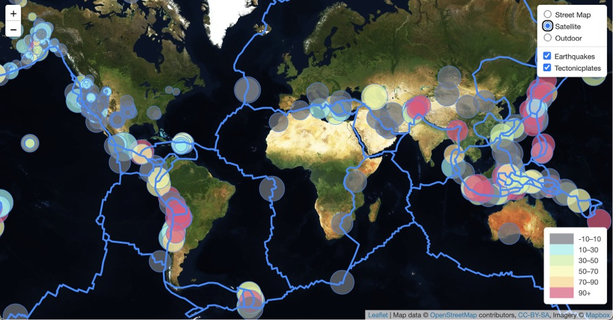

The second map creates an animation of recent 24-hour earthquakes in chronological order. World Atlas TopoJSON (https://github.com/topojson/world-atlas) is used for the map, which generates TopoJSON files from Natural Earth’s vector data. D3 is also used for calling the USGS API. The earthquakes are represented using circles which are appended using geometry data and animated using their magnitude. Below is the visualization:

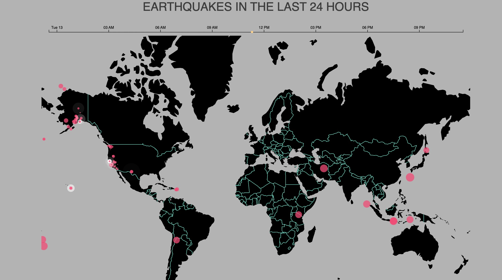
## Table of contents
* [Requirements](#requirements)
* [Static Tectonic Map](#static-tectonic-map)
* [Static Functions](#static-functions)
* [Animated Functions](#animated-functions)
* [Conclusion](#conclusion) 

## Requirements
- Leaflet (https://leafletjs-cdn.s3.amazonaws.com/content/leaflet/v1.9.3/leaflet.zip)
- D3 (https://d3js.org/d3.v7.min.js)
- World Atlas TopoJSON (https://www.npmjs.com/package/world-atlas)
- TopoJSON (https://unpkg.com/topojson-client@3)
- MapBox Documentation (https://docs.mapbox.com/)

## Static Tectonic Map
[Leaflet](https://leafletjs.com/) and [MapBox](https://docs.mapbox.com/) are used for map building. D3 is used to read my data files from the USGS site. 

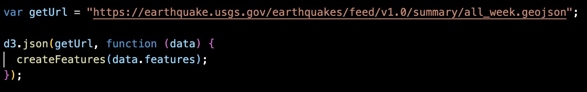

Multiple base layers are then added for versatality in mapviewing. Different views are displayed below

* ‘Street View’ - shows manmade features like streets

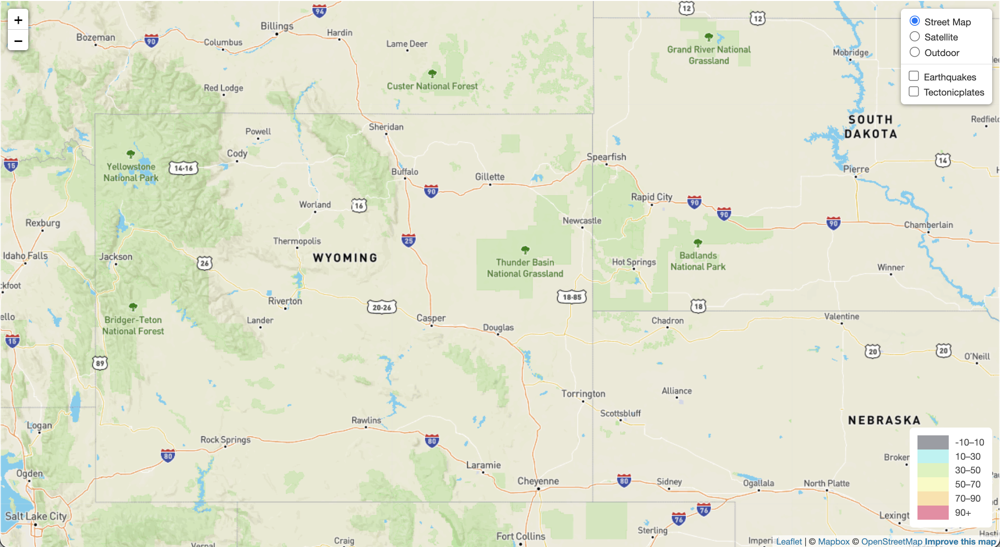

* ‘Satellite View’ – shows live view

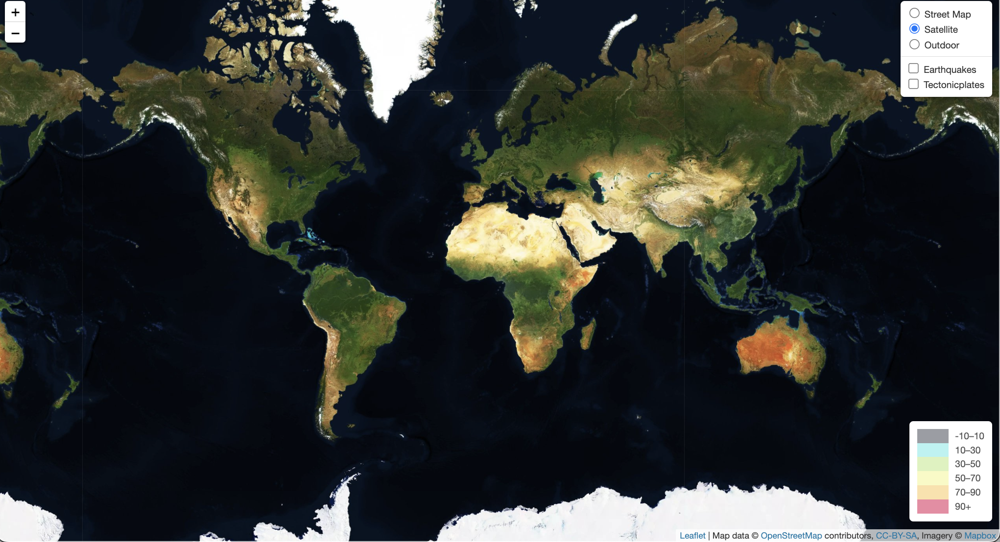

* ‘Outdoor’ – shows topographical features

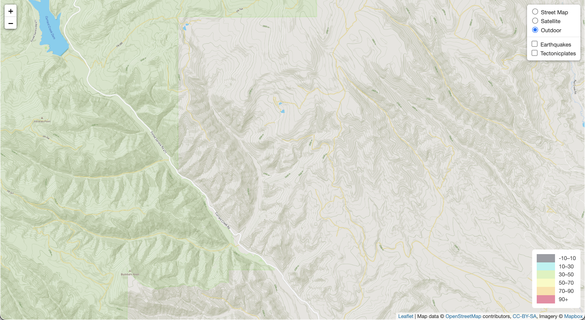

Below is the code for base map layers:

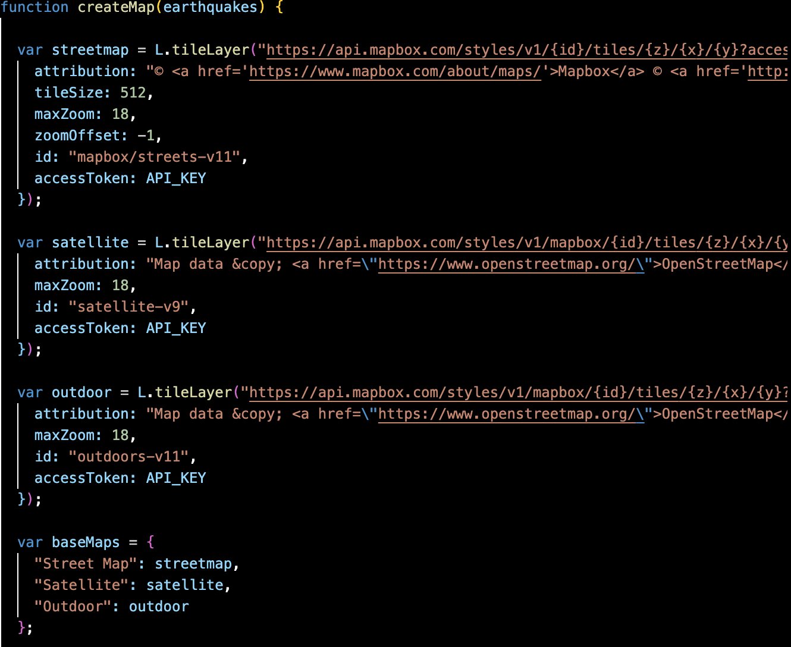

## Static Functions 

A function is created to plot the longitude and latitude for each earthquake points. The size of the point represents the magnitude and the color shows the depth of the event. When click on the points, a pop-up display will show information about the earthquake event. 

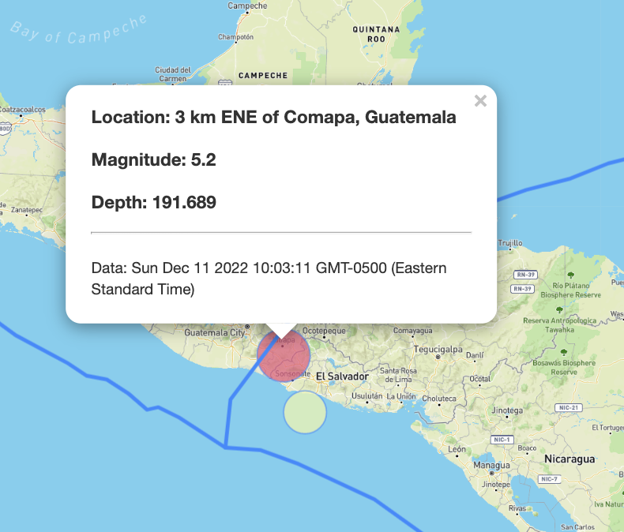

Below is the code for the functions:

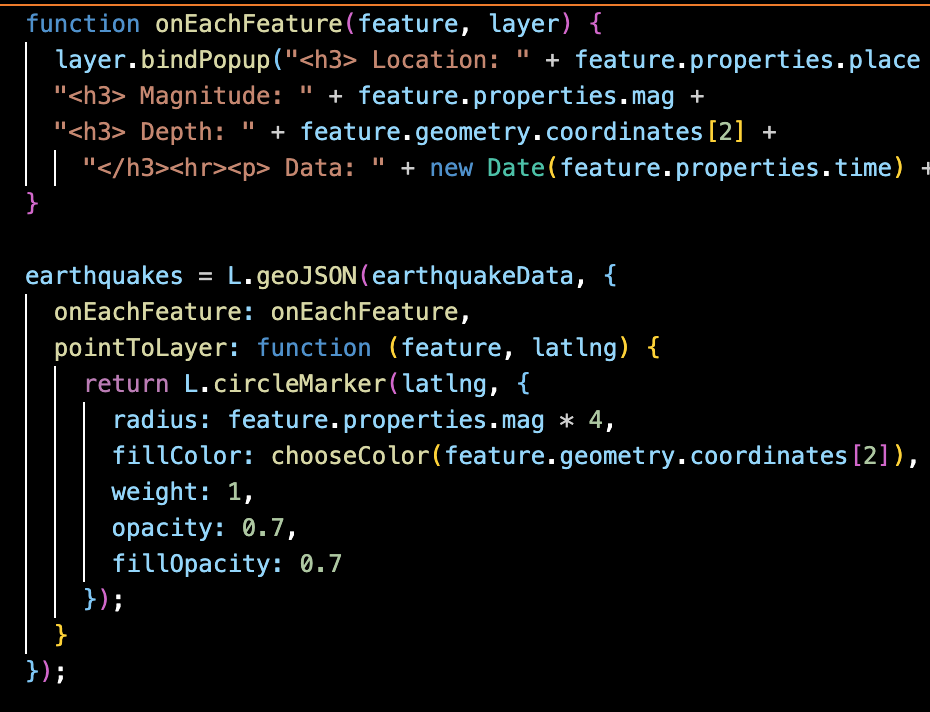

## Animated Functions

World Atlas TopoJSON (https://github.com/topojson/world-atlas) is used to generates TopoJSON files from Natural Earth’s vector data. A TopoJSON topology containing two geometry collections: countries and land, in this project only world.objects.countries is used. D3 is used to draws out a path element for the borders.Below is the code: 

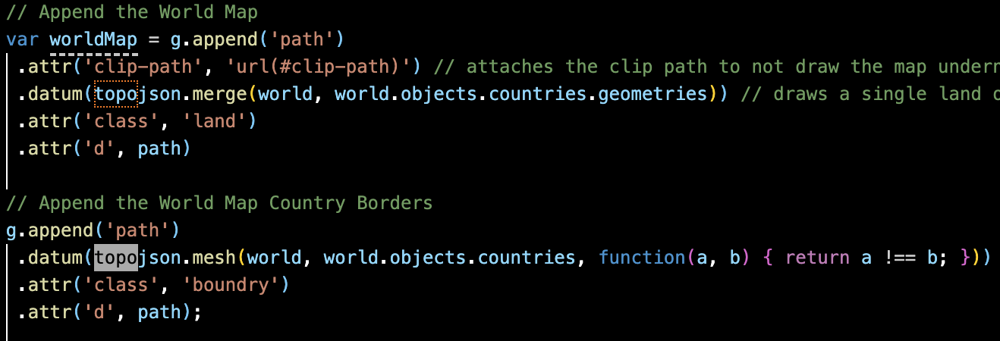

I want to have the earthquake circles show up in the order that they happened. To figure out how long to set between each quakes reveal, I decided to start with a new date object that was 24 hours ago. Then I find the difference between the time object of the current quake and my starting point of 24 hours ago using for loop.

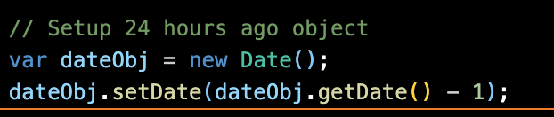

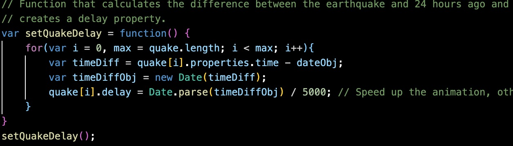

Finally, animating quake circles with the delay, and magnitude using a transition. 

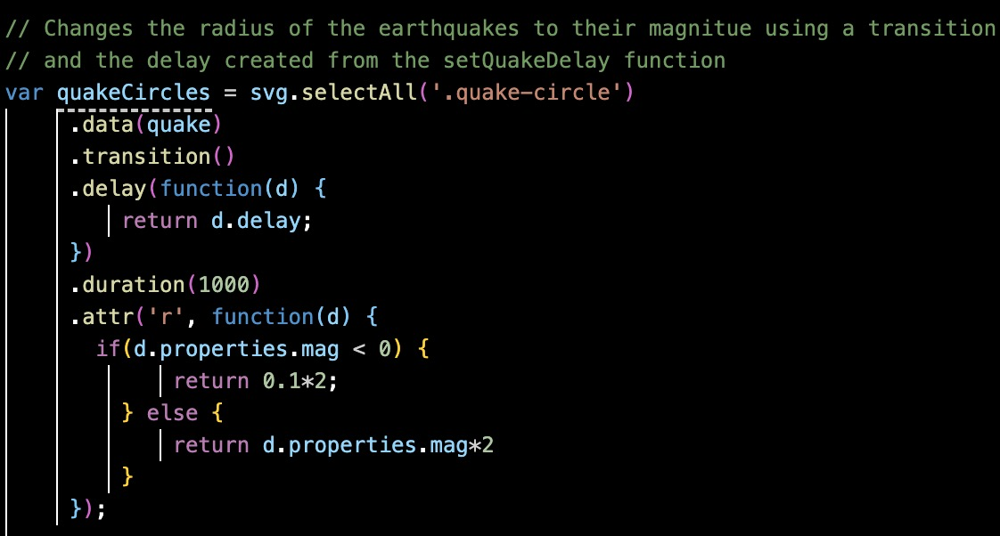

## Conclusion

The visualization with the earthquake locations and the tectonic plate layer shows that there are clustering of earthquakes and there is a clear correlation between earthquake location and location of tectonic plates. 

 

