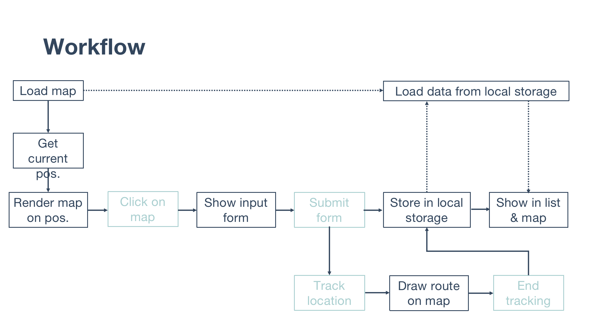

# Project: My Workout Diary

## Auther: Yingxue Ou (https://github.com/yingxueou)

## Introduction: Simply put, this is an interactive page that allows exercise enthusiasts to record or track their exercise information on a map.

## Motivation: 
My project was motivated by one of my roommates. She is an out-door running lover and runs every day. At the beginning of this semester, she complained to me that she could not find a suitable place to run near our house. Since we just moved to Philly for a few weeks, we are not familiar with our place. After a few days, she excitedly told me that she found a park just near our house where many people run there. This made me think that when workout lovers choose a suitable place to do exercise, they need to take into account many factors, such as the flow of traffic, the quality of pavements, the surrounding scenery.

## Users:
Target users Out-door workout lovers who want to explore suitable workout places in the city or are willing to share their workout places. When they are new to a place, like my roommate, they might want to gain help from other like-minded workout lovers to find a place to do exercise. Similarly, those who enjoy doing exercise in the city might want to share their favorite places with those who share their interests.

## Features:
Present user current position
A map where user can click to add new event
A map can track users’ movement(to be finished)
A list to show moving distance and time
Display all exercise events on the map
Display all exercise events in the list
Click a workout in list, show it on the map(to be finished) 

## Flowchart:

