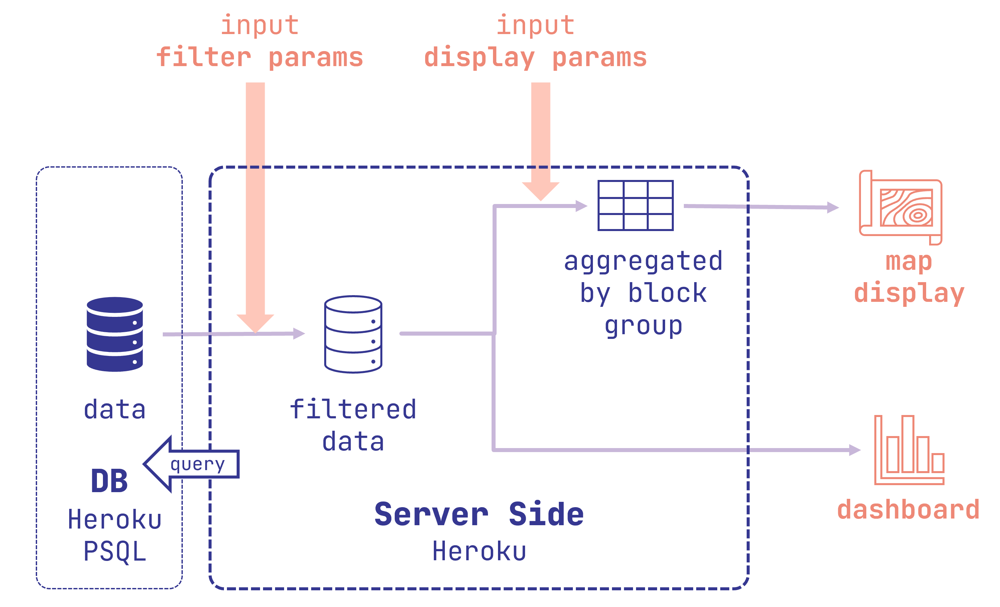
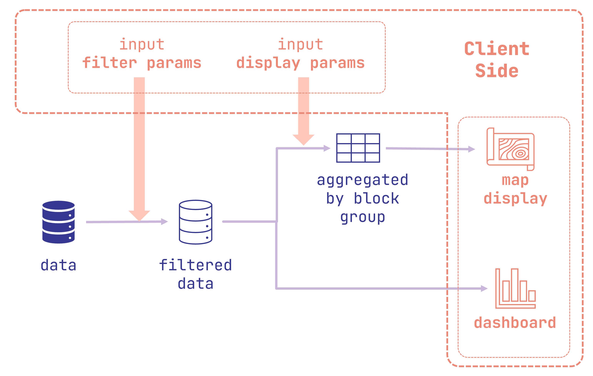

# Mobiladelphia

**Visit the app [here](https://mobiladelphia.herokuapp.com/) (desktop preferred)**

by **Jie Li** ([@Leejere](https://github.com/Leejere))

## Who is it for and what can you do with it?

Mobiladelphia is for site planners, architects, developers, city officials, or anyone with an interest for Philadelphia's mobility. In their work, they may find it useful to have these questions answered:

- Where do people in my neighborhood go to work?
- When do people typically go shopping in Chinatown and from where?
- How do people depart from Rittenhouse Square for shopping? Do they walk most often?
- Do people in University City bike more for work than in North Philadelphia?

Mobiladelphia can do two things to help answer these questions:

1. *Filter* trips by trip attributes (departure/arrival time, mode, purpose, distance, etc.) and start/end location.
2. *Display* aggregated information of the filtered data both on the map and in the dashboard.

### Use case example

**For example**, to answer the question of when people typically go shopping in Chinatown and from where, you can:

- Filter: filter *destinations* to Chinatown, and filter trip purposes to only shopping.
- Set to display departures on the map and see where the trips come from.
- Look at the dashboard to see the temporal distribution of the filtered trips.

## What functions and modules does it have?

As mentioned above, the app has **two** overall functions:

1. **Filters**. The user should be able to filter trips by trip attributes and locations. The filter instructions should form a **query** and acquire data from the web-based database.
2. **Display**.
   1. Map display. The app makes a choropleth map using the data acquired from the online database.
   2. Dashboard display. The app makes a series of graphs to showcase various aspects of the selected trips.

## How did I set it up?

### Data and data processing

[Replica](https://studio.replicahq.com/) provides *modeled* *trip-level* data **in a typical weekday** using multivarious sources:

- Census and ACS;
- Travel surveys;
- In-auto GPS data;
- Data from transit agencies;

[Here](http://help.replicahq.com/en/articles/6625924-north-atlantic-fall-2021-release-notes) Replica talks more about data sources and its methodology. I subset only trips that start and end in Philadelphia. The modeled data for Philadelphia is [regarded as trustworthy](http://help.replicahq.com/en/articles/4000393-replica-places-certainty-indicators-overview).

I used python to pre-process the data from Replica and uploaded the data to the online database. [Here](https://github.com/MUSA-550-Fall-2022/final-project-mobile_philly/blob/main/notebooks/data-preprocessing.py) is the script I used to preprocess the data.

### Server and database

I used [**Heroku**](https://www.heroku.com/)'s service for the backend server and a **PostgreSQL** database. **`Node.js`** is the chosen server framework. The back-end should receive filter and display instructions from the client, and make correct queries to the database, and send back the processed and aggregated data to the client.

### Front-end

Using JavaScript, the front end is able to record user instructions, make interactions with the backend, and display data on the map and dashboard. The display module lives in `display-map.js` and `display-dashboard.js`. The dashboard is made using [**Vega Lite API**](https://vega.github.io/vega-lite/). The filter recording module lives primarily in `filter.js`. `main.js` is where different modules cross paths and coordinate with each other.

Go to the web app and explore!