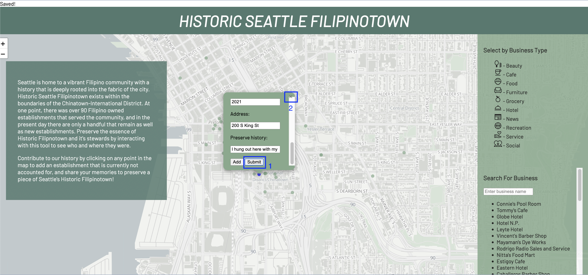

<h1> Historic Seattle Filipinotown </h1>

Name: <a href="github.com/myronbanez">Myron Bañez</a>

<h3>This project hopes to preserve Seattle Filipinotown's history by allowing users to see businesses that have existed in the space but also allowing users to input any business that is not already present.</h3>

<h3> How to use the application </h3>

 1. Fork and download the code.

 2. Type "npx http-server" in your console.

 3. Open the local host link to the application.

 4. The interface of the web application will appear. Alternatively, you can navigate to the following link: https://myronbanez.github.io/final-project/site/

 5. Click on any green point to see a historic Filipino business. There are also filter functions on the right to filter by the type of business and business name

 6. To add a new business, click on where the business is located within the map and enter the data for the fields, then press "Add."

 7. To save the business in the database, click on the "Submit" button next to "Add". You will see "Saved!" appear on the top of your screen when it is successfully submitted. Do not forget to close the window on the top right!

